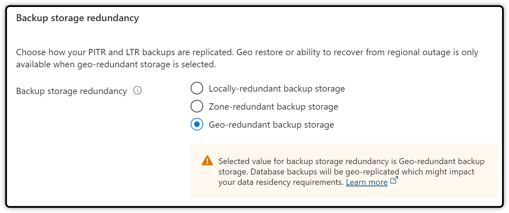
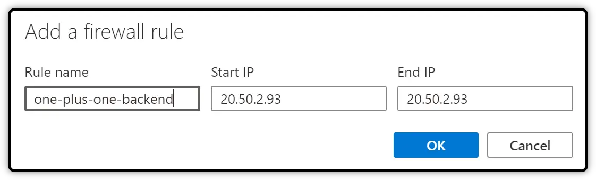

# How to integrate Azure SQL Database witn Azure Function

Source here: https://firattonak.medium.com/deploying-angular-app-using-asp-net-core-and-azure-sql-5c6e2d7ee8c0

- Go to the search box, type “SQL database,” and select “SQL databases.”

  

- Click on the “Create” link.

  

- Select Subscription and Resource group. 

> If you do not have a resource group, click on the “Create new” button and create a new resource group.

  

- Type a database name that you like, and if you do not have a server, click on the “Create a new” link.

  

- Fill in the details like below.

  

- We do not need SQL elastic pool at this time, which is why keep it as “No.” 

  

- The workload environment will be set to “Development”.

  

> Now, you should configure your database; otherwise, you might face a big bill at the end of the month. 

- Go to “Configure database” and then select “General Purpose” service tier.

  

- You do not need backup storage right now, and that is why the third option will be okay for you. 

  

- Click on the “Review + create” button and continue.

> After the SQL database is created, you should be able to see the new SQL database in the list. 

  

- Click on the database name, and then check the details of the SQL database.

  

> In order to connect to the SQL DB on Azure, you have to create a firewall rule for the Backend. 

- Go to your backend app (Function App in this case) and copy the IP.

  

- Create a firewall rule, stating that your backend IP can access the SQL Database.

  

  

  

> Now, it’s time to configure our backend project.

- Click on the “Show database connection string” link, and then copy the connection string.

  

  

- Open the backend project, go to the appsettings.Development.json file, and enter the connection string.

xxxxxx

xxxxxx

- To test your database connection, go to Microsoft SQL Management Studio and attempt to connect to the server.

  

  

  

  

  

You will notice that a new firewall rule has been created

  

