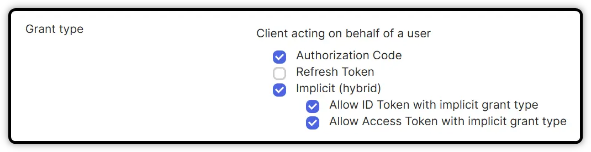

# How to integrate Okta with Angular

Source here: [part 1](https://www.youtube.com/watch?v=tuDUisdUIRA) / [part 2](https://www.youtube.com/watch?v=h_SlnNxJ33s) / [part 3](https://www.youtube.com/watch?v=gjdJB3VDN6s) / [part 4](https://www.youtube.com/watch?v=tzsTl1IUu7U&t=2s) / [part 5](https://www.youtube.com/watch?v=zI7sD-gSlF8)

## 1st step: configure everything on the Okta dashboard

- Go to https://dev-32580906-admin.okta.com/ to login
- Click on the link named *Need help sign in*
- Click on the link *Sign in with Google* 
- Select the right account
- Enter the code provided by Okta Verify on the smartphone

You are now connected as **admin**. 

Below you can see the domain name **dev-32580906.okta.com** 

<div style="display: flex; justify-content: left; padding: 10px;">
  
</div>

## 2nd step: add an application on the Okta dashboard

<div style="display: flex; justify-content: left; padding: 10px;">
  
</div>

- Click on *Create App Integration* 

<div style="display: flex; justify-content: left; padding: 10px;">
  
</div>

- Choose *OIDC - OpenID Connect* 
- Choose *Single-Page Application* 

This is the best choice for an Angular application. 

- Fill in the configuration as below. 

<div style="display: flex; justify-content: left; padding: 10px;">
  
</div>

> It will be needed to add URIs for production as well.
>
> Sign-in redirect for production: https://angular-prod-123-.azurewebsites.net/login/callback
>
> Sign-out redirect for production: https://angular-prod-123-.azurewebsites.net

- For better clarity change Sign-in like below

<div style="display: flex; justify-content: left; padding: 10px;">
  
</div>

- Once created, edit the configuration like below (should have been done at first).

<div style="display: flex; justify-content: left; padding: 10px;">
  
</div>

- Don't forget to assign people to this app like done below.

<div style="display: flex; justify-content: left; padding: 10px;">
  
</div>

- We will use the default authorization server like showed below.

<div style="display: flex; justify-content: left; padding: 10px;">
  
</div>

## 3rd step: add routing to our Angular application

- In **app.modules.ts**

```typescript
import { Routes, RouterModule } from '@angular/router';
...
const appRoutes: Routes = [ 
   { path: 'dashboard', component: DashboardComponent 
}];
...
@NgModule({
   declarations: [ ... ],
   imports: [ ..., RouterModule.forRoot(appRoutes) ], ... ],
   providers: [ ... ],
   bootstrap: [ AppComponent ]
})
export class appModule { }
```

- In **app.component.html**

```html
<router-outlet></router-outlet>
```

## 4rd step: install Okta into our Angular application

- Check this **link:** https://github.com/okta/okta-angular
- Execute in **terminal** `npm install --save @okta/okta-angular @okta/okta-auth-js`
- In **app.module.ts**

```typescript
import { environment } from "../environments/environment.development";
import { OktaAuthModule, OktaConfig, OktaAuthGuard, OktaCallbackComponent } from '@okta/okta-angular';
import { OktaAuth } from '@okta/okta-auth-js';

const authConfig = {
  issuer: https://${environment.devOktaDomain}/oauth2/default,
  clientId: environment.clientId,
  redirectUri: environment.redirectUri
};

const oktaAuth = new OktaAuth(authConfig);
const moduleConfig: OktaConfig = { oktaAuth };
const appRoutes: Routes = [ 
  { path: '', redirectTo: 'dashboard', pathMatch: 'full' },
  { path: 'dashboard', component: DashboardComponent },
  { path: 'details', component: DetailsComponent, canActivate: [OktaAuthGuard] },
  { path: 'login/callback', component: OktaCallbackComponent },
  { path: 'logout/callback', component: OktaCallbackComponent }
];

@NgModule({
  declarations: [
    AppComponent,
    DashboardComponent,
    DetailsComponent
  ],

  imports: [
    BrowserModule,
    AppRoutingModule,
    OktaAuthModule.forRoot(moduleConfig),
    RouterModule.forRoot(appRoutes)
  ],
  providers: [
    provideHttpClient(),
  ],
  bootstrap: [AppComponent]
})
export class AppModule { }
```

- In **environments.development.ts**

```typescript
export const environment = {
  production: false,
  apiUrl: 'http://localhost:7071/api/',
  devOktaDomain: 'dev-32580906.okta.com',
  clientId: '0oajszkgw4vDmzpbm5d7',
  redirectUri: 'http://localhost:4200/login/callback'
};
```

- In **app.component.ts**

```typescript
import { Component, Inject, OnInit } from '@angular/core';
import { DataService } from './data.service';
import { OktaAuth, AuthState } from '@okta/okta-auth-js';
import { OKTA_AUTH } from '@okta/okta-angular';

@Component({
  selector: 'app-root',
  templateUrl: './app.component.html',
  styleUrl: './app.component.css'
})

export class AppComponent implements OnInit
{
  title = 'AngularProjectPlusAzureFunction1';
  isAuthenticated: boolean = false;

  constructor(@Inject(OKTA_AUTH) public oktaAuth: OktaAuth) { }

  async ngOnInit()
  {
    this.isAuthenticated = await this.oktaAuth.isAuthenticated();
    this.oktaAuth.authStateManager.subscribe( 
          (handler: AuthState) => this.isAuthenticated = handler.isAuthenticated ?? false );
    );
  }

  login()
  {
    this.oktaAuth.signInWithRedirect();
  }

  logout()
  {
    this.oktaAuth.signOut();
  }
}
```

- Another method still in **app.component.ts** 

```typescript
import { OktaAuth } from '@okta/okta-auth-js';
import { OktaAuthStateService, OKTA_AUTH } from '@okta/okta-angular';

constructor(
    @Inject(OKTA_AUTH) public oktaAuth: OktaAuth,
    private authStateService: OktaAuthStateServ
  ) { }

  async ngOnInit()
  {
    this.isAuthenticated = await this.oktaAuth.isAuthenticated();
    this.authStateService.authState$.subscribe(
      (response) => {
          this.isAuthenticated = response.isAuthenticated ?? false;
      }
    );
  }
```

- In **app.component.html**

```html
<button *ngIf="isAuthenticated" (click)="logout()">Logout</button>
<router-outlet></router-outlet>
```