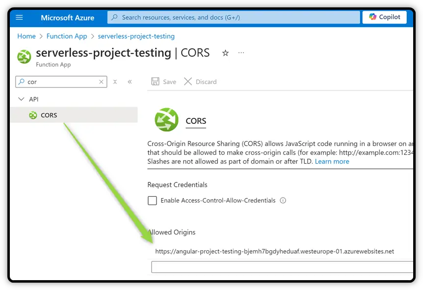

# How to publish backend Azure Function

> This document relates to Visual Studio Code

Source here: [learn.microsoft.com/...](https://learn.microsoft.com/en-us/azure/azure-functions/functions-develop-vs-code?tabs=node-v4%2Cpython-v2%2Cisolated-process%2Cquick-create&pivots=programming-language-csharp)

Prerequisite: installing VS Code  extensions below:

- Azure Account
- Azure Functions
- Azure Resources

## 1st step: create Function App in Azure

- Open Visual Studio Code 
- Open a folder containing the Azure Function project to publish
- Press `F1` key to show the Command Palette
- Type *Azure Function*
- In the list, select **Create Function App in Azure**
- Select subscription: **Visual Studio Professional**
- Enter a name for the new *function app*
- Select a runtime stack: **.NET 8 (LTS) In-process**
- Select a location: **West Europe**

> The Function App is now created on Azure. **Still need to deploy !**

## 2nd step: Deploy to Function App

- Press `F1` key to show the Command Palette
- Type *Azure Function*
- In the list, select **Deploy to Function App**
- Select a subscription: **Visual Studio Professional**
- Select a function app: (the one created in step 1)

The Function App is deployed on Azure.

## 3rd step: Configuring CORS on Azure

