# How to publish frontend Angular to Azure

> This document relates to Visual Studio Code

Source here: [henriquesd.medium.com/...](https://henriquesd.medium.com/deploying-an-angular-application-in-azure-9f89edfe2b9c)

## Creating an APP Service

To deploy the Front-End application, we need to create an “App Service”. 

In Azure portal, search for “App Services” 

(this service allows us to deploy our WEB API as software as a service (SaaS):

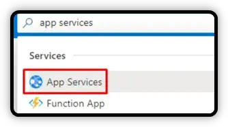

Then click in “Create”:

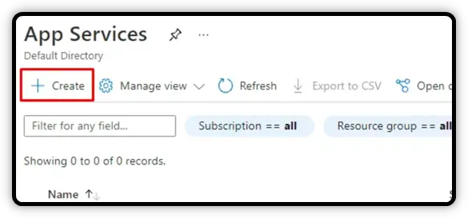

Now it’s necessary to configure your app service, by selecting your subscription, your resource group, 

informing a name for the service, the tech stack, operating system, region and the **plan:**

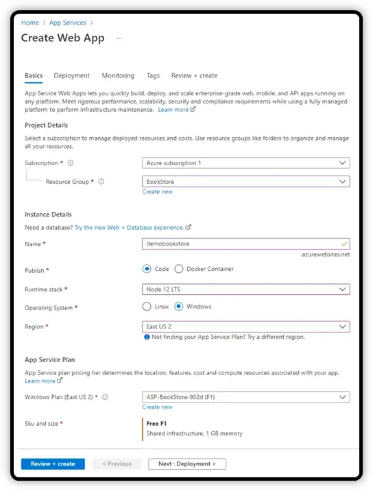

> Note that I’m using the plan “Free F1”, because this is a demo. 
>
> If you want to deploy your application at a production level, I recommend you to use a “Production” plan.

Then click in “Review + create”, confirm the information and click in “Create”. 

Can take some time until your service is created, you can check the status in the notifications (the bell icon in the top bar).

## Deploying the Angular App with “Azure App Service”

To deploy the Angular application, we are going to use the Visual Studio Code, and an extension named “Azure App Service”.

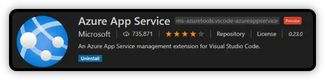

You can download this extension in your Visual Studio Code and use your Azure account to authenticate.

This project uses a back-end application that was already deployed in Azure. 

So we need to add the URL to the API in the “environment.ts” file:

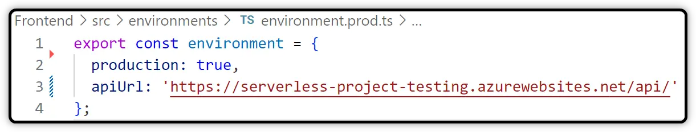

In the example above:

- **environment.prod.ts** is dedicated to production settings
- **environment.ts** is dedicated to development settings

Don't forget to configure file replacement in *angular.json* like showed below. 

This is needed when building the application for production.

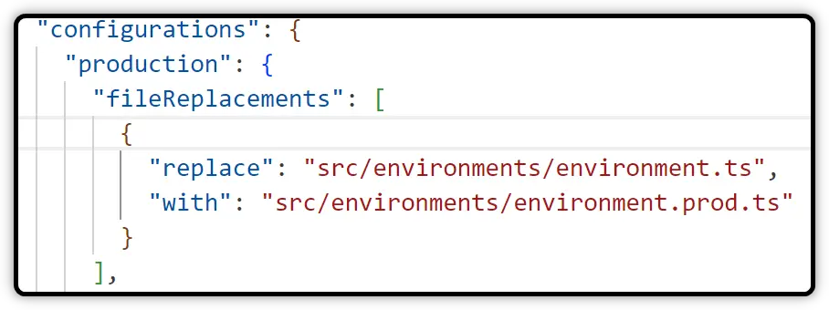

After that, by a command-line tool, execute the command to build the application to production:

```
ng build --configuration production
```

**Need help** on this command ? `ng build --help`

Check this link as well: https://angular.dev/tools/cli/environments

After executing this command, you can find some files inside of a folder inside of the “dist” folder. 

These files are the files that we need to deploy in Azure.

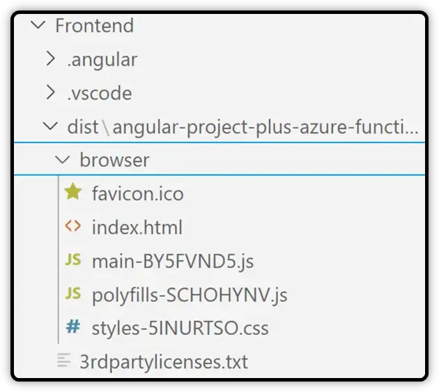

- In Visual Studio Code, go to the Azure extension and Sign in to Azure. 
- A page in your browser will open and then add your authentication information. 
- Next, you will see a branch named *App Services*. 
- Open this branch to see all your app services available. 
- Right click on the desired item and choose *Deploy to web app...* 
- Click on *Browse...*

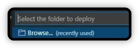

- Select the folder that is inside of the “dist” folder.
- After deploying, you should be able to access the application in the browser

```
https://angular-project-testing-123456789....westeurope-01.azurewebsites.net/
```

## Deploying the Angular App with “KUDU”

> Kudu is the engine behind a number of features in Azure App Service related to source control based deployment, 
>
> and other deployment methods like Dropbox and OneDrive sync. (Microsoft Documentation)

Another possible way to deploy the Angular application in Azure is by KUDU. 

This way we can manually add the files by accessing the App Service in the Azure portal and searching for “Advanced tools”:

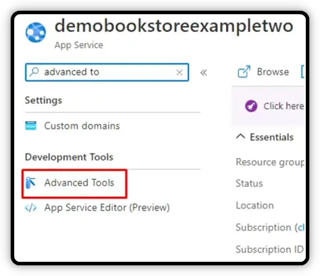

Click in “Go”:

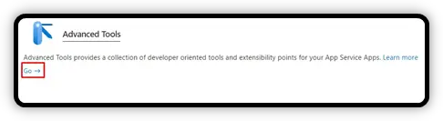

Another page in the browser will open, then click in “Debug console” > CMD:

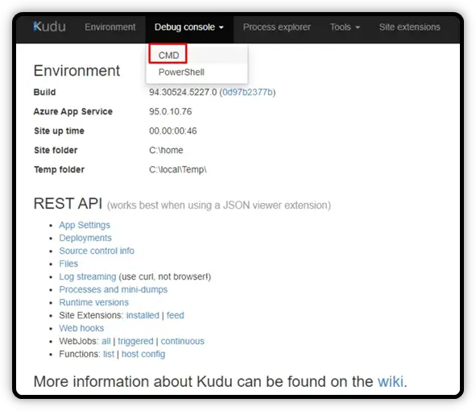

You will see this page:

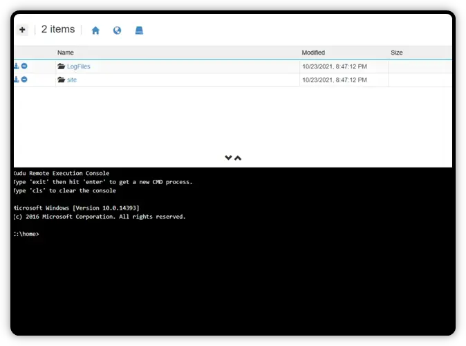

Click in “site” and in “wwwroot”, and click in the “+” icon to add a new folder:

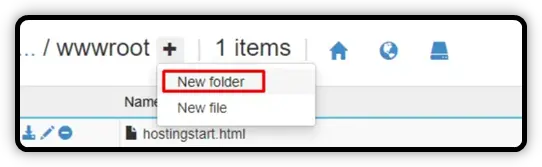

Create a folder for your project:

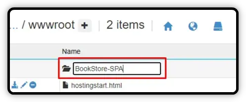

Open your project local folder, and select all the files in the folder inside in 

the “dist” folder (after executing the `ng build --configuration production` command):

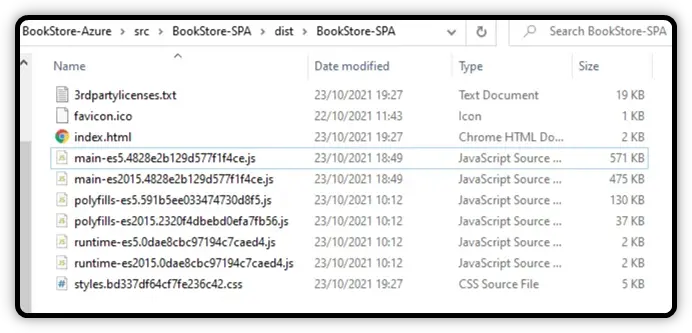

Drag and drop these files into the new folder that you created:

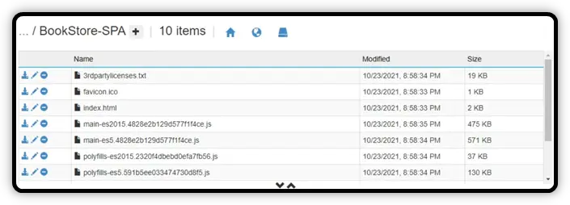

In your App Service in Azure portal, search for “Configuration”:

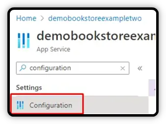

Click in *“New virtual application or directory”*, and change from *“site\wwwroot\”* 

to *“site\wwwroot\BookStore-SPA”* (or the name of the folder that you created):

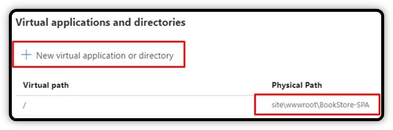

After that remember to save the changes. Now you can also access the application.

> **Note**: this is not mandatory to create a new folder inside *wwwroot*. 
>
> You can simply drag and drop your local files inside the *wwwroot* folder and replace existing ones. 

## Conclusion

These are two different ways to deploy an Angular application in Azure. 

The first one was using an extension for Visual Studio Code, and the other option using the Advanced Tools in Azure Portal. 

Deploying your application in a cloud environment as Azure brings many advantages for you 

since you don’t need to worry about the infrastructure, focusing more on your application.