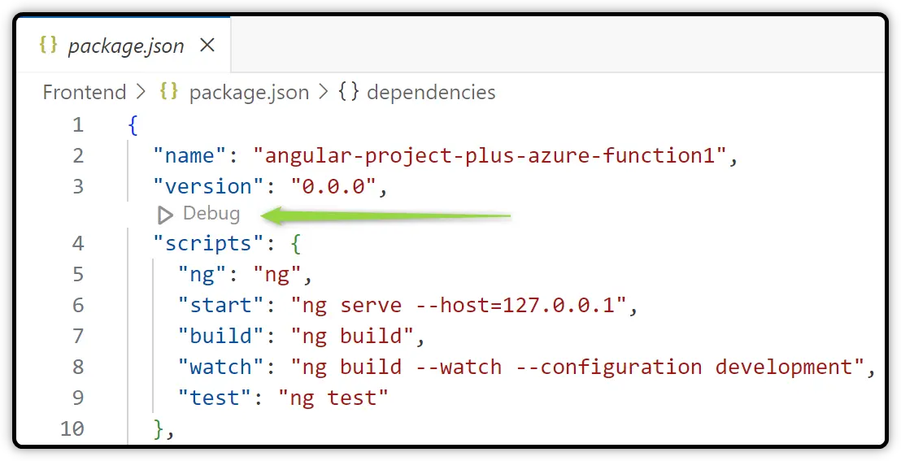

# How to start backend and frontend

## Start backend

- Right click on the *Backend* folder
- Click on  *Open in Integrated Terminal*
- Execute `func host start --verbose`

## Start frontend

- Right click on the *Frontend* folder
- Click on  *Open in Integrated Terminal*
- Execute `npm run start`
- Or `ng serve`
- Or open the *package.json* file and click on the *Debug* button

